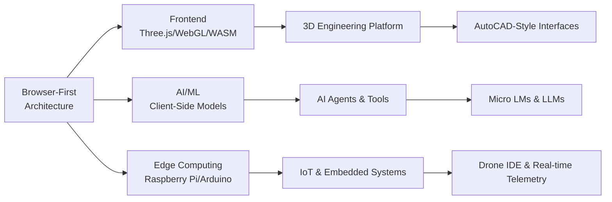

# webXOS 2026: Browser-First Web3 Development Platform

<div style="
    background: #00FF00;
    border-left: 4px solid #00FF00;
    padding: 1.5rem;
    margin: 2rem 0;
    font-family: 'Fira Code', 'Courier New', monospace;
    color: #00FF00;
    border-radius: 0 8px 8px 0;
">
    <pre style="
        font-size: 12px;
        line-height: 1.2;
        margin: 0;
        overflow-x: auto;
        color: #00FF00;
    ">
      ___           ___                         ___            ___           ___     
     /\  \         /\__\         _____         /|  |          /\  \         /\__\    
    _\:\  \       /:/ _/_       /::\  \       |:|  |         /::\  \       /:/ _/_   
   /\ \:\  \     /:/ /\__\     /:/\:\  \      |:|  |        /:/\:\  \     /:/ /\  \  
  _\:\ \:\  \   /:/ /:/ _/_   /:/ /::\__\   __|:|__|       /:/  \:\  \   /:/ /::\  \ 
 /\ \:\ \:\__\ /:/_/:/ /\__\ /:/_/:/\:|__| /::::\__\_____ /:/__/ \:\__\ /:/_/:/\:\__\
 \:\ \:\/:/  / \:\/:/ /:/  / \:\/:/ /:/  / ~~~~\::::/___/ \:\  \ /:/  / \:\/:/ /:/  /
  \:\ \::/  /   \::/_/:/  /   \::/_/:/  /      |:|~~|      \:\  /:/  /   \::/ /:/  / 
   \:\/:/  /     \:\/:/  /     \:\/:/  /       |:|  |       \:\/:/  /     \/_/:/  /  
    \::/  /       \::/  /       \::/  /        |:|__|        \::/  /        /:/  /   
     \/__/         \/__/         \/__/         |/__/          \/__/         \/__/    
    </pre>
</div>

<div align="center">


**Innovative software development company developing progressive web applications tailored for decentralized web3 environments**

[](https://webxos.netlify.app)
[](https://github.com/webxos/webxos)
[](https://huggingface.co/webxos)
[](https://x.com/webxos)

</div>

---

## 🚀 **What is webXOS?**

<div align="center">
<strong>webXOS delivers lightweight, modular progressive web apps (PWAs) that prioritize performance, privacy, and sustainability.</strong>
</div>

<div align="center" style="margin: 20px 0;">
  <table>
    <tr>
      <td align="center" width="33%">
        <strong>🔄 Modular</strong><br>
        Self-contained `.html` files
      </td>
      <td align="center" width="33%">
        <strong>⚡ High-Performance</strong><br>
        Native JS + WebGL + WASM
      </td>
      <td align="center" width="33%">
        <strong>🔒 Privacy-First</strong><br>
        100% client-side processing
      </td>
    </tr>
  </table>
</div>

**Leveraging native JavaScript, WebGL, Three.js, and WebAssembly (WASM)**, our ecosystem encompasses eco-friendly apps, retro games, and client-side AI agents, all designed to operate seamlessly in the browser.

### ✨ **Core Philosophy**
> *"Bridging high-performance computing with minimalist hardware through intelligent browser-native solutions."*

---

## 🎯 **Vision & Mission**

<div align="center">
<strong>The leading innovator in bridging the gap between high-performance computing and minimalist hardware</strong>
</div>

**WebXOS redefines the potential of edge computing through intelligent, browser-native solutions**, specializing in delivering high-performance, modular, and browser-based applications by integrating cutting-edge AI engineering, prompting techniques, and advanced mathematics.

### 🎯 **Core Specializations**

| Area | Focus | Key Technology |
|------|-------|----------------|
| **IoT Software Development** | Architecture for connected devices | Embedded Linux, Real-time processing |
| **AI Engineering & Prompting** | Bespoke AI models and strategic prompting | Custom ML models, Edge AI frameworks |
| **Modular Browser-Based Software** | Cross-platform, zero-installation experiences | PWA, Web Components, Service Workers |
| **Edge Computing Optimization** | Low-power SBCs and microcontrollers | Raspberry Pi, Arduino optimization |
| **Advanced Mathematics & Reasoning** | Sophisticated algorithms for minimal latency | Computational logic, Optimization algorithms |

---

## 🛠️ **Technology Stack**

<div align="center">



</div>

### **Frontend Architecture**
```html
<!-- Single-file PWA Example Structure -->
<!DOCTYPE html>
<html>
<head>
    <title>webXOS App</title>
    <meta name="viewport" content="width=device-width, initial-scale=1">
    <link rel="manifest" href="app.webmanifest">
    <style>/* All CSS inline */</style>
</head>
<body>
    <!-- App Content -->
    <script>/* All JavaScript inline */</script>
    <script type="module">/* WASM/WebGL modules */</script>
</body>
</html>
```

**Key Technologies:**
- **Frontend**: Three.js, WebGL, WebAssembly (Wasm), Vanilla JS
- **AI/ML**: Custom Micro LMs, Client-side inference
- **Backend**: Node.js, Python (AI/ML), C++ (performance modules)
- **Hardware**: Raspberry Pi, Arduino, IoT devices
- **Protocols**: P2P, WebRTC, Web3

---

## 📦 **Product Ecosystem**

### **🎮 1. Three.js 3D Engineering Platform**
> **Web-native 3D engineering environments for edge devices**

```javascript
// Example: Browser-based CAD interface
const engine = new WebXOS.Engine({
    renderer: 'webgl',
    precision: 'high',
    offline: true,
    compatible: ['raspberry-pi', 'mobile']
});
```

**Features:**
- ✅ AutoCAD-style browser interface
- ✅ Real-time WebGL rendering optimized for Raspberry Pi
- ✅ AI-assisted design and predictive modeling
- ✅ Offline-capable engineering tools

### **🚁 2. Drone Integrated Development Environment (IDE)**
> **Browser-based programming for autonomous systems**

```javascript
// Example: Drone flight programming
const droneIDE = new WebXOS.DroneIDE({
    telemetry: 'real-time',
    programming: 'modular-blocks',
    aiNavigation: true,
    edgeProcessing: true
});
```

**Features:**
- ✅ Drag-and-drop flight planning
- ✅ Real-time browser telemetry dashboards
- ✅ Edge AI for autonomous navigation
- ✅ Cloud-independent operation

### **🎯 3. Browser-Based Gaming Software**
> **"Min-maxing" computational power for web gaming**

```javascript
// Example: High-performance web game
const game = new WebXOS.GameEngine({
    targetFPS: 60,
    maxMemory: '256mb',
    compatibleDevices: ['pi-4', 'mobile-lowend'],
    aiNPCs: true
});
```

**Features:**
- ✅ Performance-optimized for constrained hardware
- ✅ AI-powered game logic and procedural generation
- ✅ Cross-platform play (Raspberry Pi to smartphone)
- ✅ Offline multiplayer via P2P

### **🤖 4. AI Agents & Client-Side Tools**
> **Privacy-first AI that never leaves your device**

```javascript
// Example: Client-side AI agent
const aiAgent = new WebXOS.AIAgent({
    model: 'micro-lm-50mb',
    processing: 'client-side',
    privacy: 'end-to-end-encrypted',
    offline: true
});
```

**Features:**
- ✅ Micro LMs (<50MB) running in browser
- ✅ Zero data transmission to servers
- ✅ End-to-end encrypted processing
- ✅ Offline AI capabilities

---

## 🔒 **Privacy-First Architecture**

<div align="center">
<table>
<tr>
<td width="50%">

### **🛡️ How We Protect Privacy**
- **Zero Backend Storage**: Data never leaves your device
- **Client-Side Encryption**: End-to-end encryption in browser
- **No Cloud Dependencies**: Full offline functionality
- **Secure Key Management**: WebAuthn and browser storage

</td>
<td width="50%">

### **🔍 Privacy Use Cases**
1. **Secure Data Storage**: Encrypted client-side databases
2. **Private AI Tools**: Local processing of sensitive data
3. **Browser-Based Auth**: Passwordless authentication
4. **Local File Processing**: No uploads for media editing

</td>
</tr>
</table>
</div>

### **Privacy Architecture Diagram**
```
User Device (Browser)
    ├── Encrypted Local Storage
    ├── WebAssembly Sandbox
    ├── Client-Side AI Models
    └── P2P Connections Only
        └── No Central Servers
```

---

## 🌱 **Eco-Friendly & Sustainable**

### **🌍 Environmental Impact Reduction**
- **Low Power Consumption**: Optimized for Raspberry Pi (2-5W)
- **No Server Farms**: Client-side processing eliminates data centers
- **Small Footprint**: Apps typically <5MB, reducing bandwidth
- **Long Device Lifespan**: Extends usefulness of older hardware

### **📊 Performance Metrics**
| Metric | webXOS App | Traditional App |
|--------|------------|-----------------|
| **Memory Usage** | 50-100MB | 500MB-2GB |
| **Power Consumption** | 2-5W | 50-200W |
| **Startup Time** | <2s | 10-30s |
| **Offline Capable** | ✅ Yes | ❌ No |

---

## 🚀 **Getting Started**

### **Quick Start: Single-File Deployment**
```bash
# 1. Download any webXOS app
wget https://webxos.netlify.app/tools/example-app.html

# 2. Open in any browser
# That's it! No installation needed.
```

### **Development Setup**
```bash
# Clone the repository
git clone https://github.com/webxos/webxos.git

# Explore modular apps
cd webxos/apps

# Each .html file is a complete, runnable application
```

### **Hardware Compatibility**
```yaml
fully_supported:
  - Raspberry Pi 3/4/5 (any OS with browser)
  - Arduino (with web interface)
  - Any smartphone (Android/iOS)
  - Desktop browsers (Chrome/Firefox/Safari)
  - Low-end PCs (≥1GB RAM)

minimum_requirements:
  screen: "≥320px width"
  memory: "≥256MB RAM"
  browser: "ES2020 compatible"
  storage: "≥5MB free space"
```

---

## 📈 **Community & Contributions**

<div align="center">

[](https://github.com/webxos/webxos/stargazers)
[](https://github.com/webxos/webxos/network/members)
[](https://github.com/webxos/webxos/issues)
[](LICENSE)

</div>

### **🌐 Connect With Us**
- **Website**: [webxos.netlify.app](https://webxos.netlify.app)
- **GitHub**: [github.com/webxos](https://github.com/webxos)
- **X/Twitter**: [@webxos](https://x.com/webxos)
- **Hugging Face**: [huggingface.co/webxos](https://huggingface.co/webxos)

### **🤝 Contributing**
We welcome contributions! Each app is modular and self-contained:
1. Fork the repository
2. Create a new `.html` file in `/apps/`
3. Ensure it's fully self-contained (HTML/CSS/JS inline)
4. Submit a pull request

**Guidelines:**
- Keep file size <5MB when possible
- Ensure compatibility with Raspberry Pi 3+
- Include offline functionality
- No external dependencies

---

## 📊 **Stats & Recognition**

<div align="center">


[](https://user-badge.committers.top/united_states/webXOS)

</div>

---

## 📄 **License & Acknowledgments**

**MIT License** - See [LICENSE](LICENSE) for details.

### **Built With**
- [Three.js](https://threejs.org/) - 3D WebGL rendering
- [WebAssembly](https://webassembly.org/) - Near-native performance
- [Service Workers](https://developer.mozilla.org/en-US/docs/Web/API/Service_Worker_API) - Offline capabilities
- [WebGL](https://developer.mozilla.org/en-US/docs/Web/API/WebGL_API) - Hardware-accelerated graphics

### **Inspired By**
- The original vision of the Web as a platform
- Sustainable computing and environmental responsibility
- Privacy-first design principles
- The potential of edge computing and IoT

---

<div align="center">

## **🚀 Ready to Build the Future?**

[Explore Our Apps](https://webxos.netlify.app) · [View Source Code](https://github.com/webxos/webxos) · [Join the Community](https://x.com/webxos)

**webXOS: Redefining what's possible in a browser window.**

</div>
