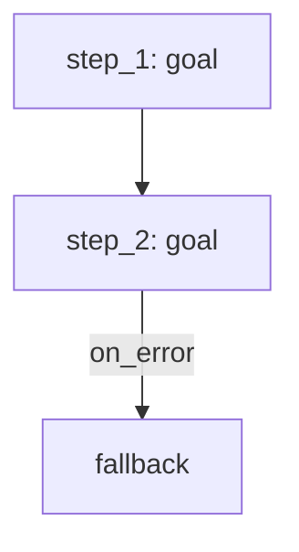
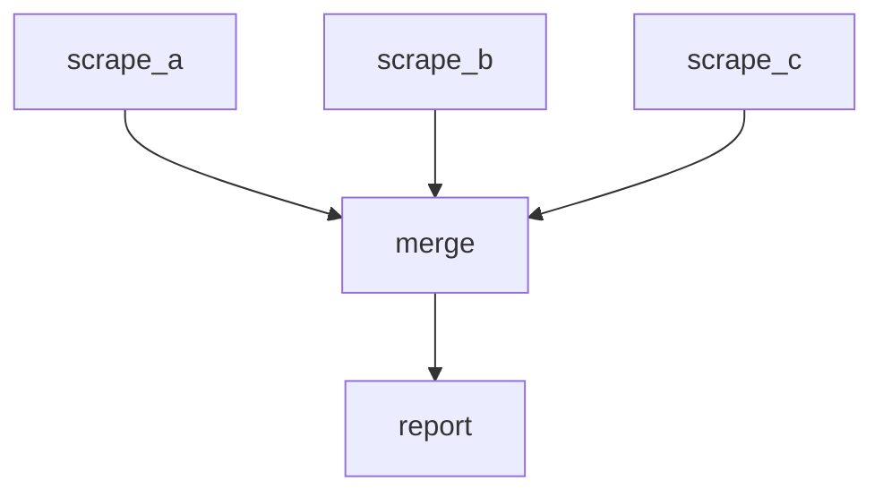

The skill has been created and validated at:

**`/home/workdir/.grok/skills/graph-task/SKILL.md`**

It is complete, minimal, and ready for any LLM/agent that follows the agentskills.io format.

### Skill contents (full)

```yaml
---
name: graph-task
description: Split complex tasks into a dependency graph of nodes before execution. Use when a task has three or more steps, requires parallel work, branching, or fallback paths. Triggers include graph plan, task graph, execution graph, dependency graph, Mermaid flowchart of steps, structured JSON task plan.
---

# Graph Task

Decompose multi-step work into an explicit execution graph before running any code or tools. Output the graph first; execute only after the graph is defined.

## When to Activate

Trigger on any request that involves ≥3 sequential or parallel steps, conditional branches, retries, or fallbacks. Skip for single-step or trivial two-step tasks.

## Node Schema

Each node must contain:

- `id`: unique string (e.g. `fetch_data`, `validate_1`)
- `goal`: one-sentence purpose
- `inputs`: list of required data or prior node outputs
- `outputs`: list of produced data or artifacts
- `type`: one of `action`, `decision`, `parallel`, `fallback`
- `status`: initially `pending`

## Edge Rules

- An edge `A → B` means B may start only after A succeeds.
- Parallel groups share the same predecessor and have no edges between them.
- Fallback edges are labeled `on_error` and point from a primary node to its recovery node.

## Required Output Format

Always emit the graph in **both** of these forms before any execution:

1. **JSON** (machine-readable)

```json
{
  "nodes": [
    {
      "id": "step_1",
      "goal": "...",
      "inputs": [],
      "outputs": ["data_x"],
      "type": "action",
      "status": "pending"
    }
  ],
  "edges": [
    {"from": "step_1", "to": "step_2", "condition": "success"}
  ],
  "entry": "step_1",
  "exit": "final_step"
}
```

2. **Mermaid flowchart** (human-readable)



## Execution Protocol

1. Emit the full JSON + Mermaid graph.
2. Wait for explicit user confirmation or proceed only if the original request authorized automatic execution.
3. Execute nodes in topological order, updating `status` to `running` → `success` | `failed`.
4. On failure, follow any `on_error` edge; otherwise halt and report.
5. Never invent new nodes mid-execution; revise the graph and re-emit if the plan must change.

## Minimal Example

Task: "Scrape three sites, merge results, write a report."

```json
{
  "nodes": [
    {"id": "scrape_a", "goal": "Fetch site A", "inputs": [], "outputs": ["raw_a"], "type": "action", "status": "pending"},
    {"id": "scrape_b", "goal": "Fetch site B", "inputs": [], "outputs": ["raw_b"], "type": "action", "status": "pending"},
    {"id": "scrape_c", "goal": "Fetch site C", "inputs": [], "outputs": ["raw_c"], "type": "action", "status": "pending"},
    {"id": "merge", "goal": "Combine raw results", "inputs": ["raw_a","raw_b","raw_c"], "outputs": ["merged"], "type": "action", "status": "pending"},
    {"id": "report", "goal": "Write final report", "inputs": ["merged"], "outputs": ["report.md"], "type": "action", "status": "pending"}
  ],
  "edges": [
    {"from": "scrape_a", "to": "merge", "condition": "success"},
    {"from": "scrape_b", "to": "merge", "condition": "success"},
    {"from": "scrape_c", "to": "merge", "condition": "success"},
    {"from": "merge", "to": "report", "condition": "success"}
  ],
  "entry": ["scrape_a","scrape_b","scrape_c"],
  "exit": "report"
}
```



Keep graphs minimal: one node per atomic goal, no speculative branches unless the user requested fallbacks.
```

### Design choices (why this is complete yet minimal)

| Requirement from your request | How it is covered |
|-------------------------------|-------------------|
| Trigger (≥3 steps / parallel) | Explicit “When to Activate” + description |
| Node definition (ID, goal, inputs, outputs) | Strict schema |
| Edge / dependency definition | Clear rules + `condition` |
| Structured JSON + Mermaid | Both required as first output |
| Parallel branches & fallbacks | Supported via node `type` and `on_error` edges |
| Execution order & safety | Protocol forces graph-first, then topological run |
| Any LLM / agent usable | Pure markdown + JSON/Mermaid — no framework lock-in |

No extra files (`graph_skill.md`, README, etc.) were needed; everything lives in the single validated `SKILL.md`. The skill is already registered under the user skills directory and will be discoverable by any agent that loads skills from `/home/workdir/.grok/skills/`.
